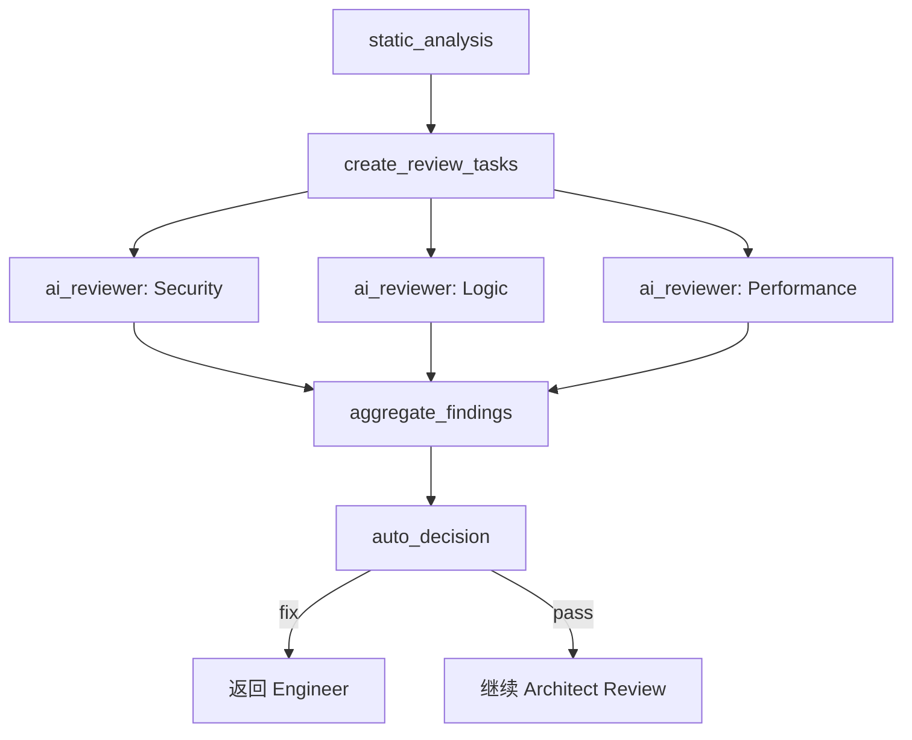

# 🛡️ Code Quality Gates 设计文档

**版本**: 1.0  
**日期**: 2026-03-06  
**状态**: Draft  

## 1. 概述

### 1.1 目标

为 Team Mode 实现自动化代码质量门控，在 Engineer 生成代码后自动执行：
1. **静态分析** - Ruff lint/format + mypy 类型检查
2. **AI 并行审查** - 多个专业化 Agent 并行审查代码
3. **自动决策** - 根据发现自动决定通过或返回修复

### 1.2 设计原则

| 原则 | 说明 |
|------|------|
| **无 HITL** | 全自动流程，无需人工干预 |
| **并行执行** | 使用 LangGraph Send API 实现多 Agent 并行 |
| **自动修复** | 可修复的问题自动修复 |
| **闭环迭代** | 未通过则返回 Engineer 修复，再次检查 |

### 1.3 架构图

```
[Engineer 生成代码]
        │
        ▼
┌───────────────────────────────────────────────────┐
│  Gate 1: 静态分析                                  │
│    • Ruff lint + format (自动修复)                │
│    • mypy type check                              │
└───────────────────────────────────────────────────┘
        │
        ▼
┌───────────────────────────────────────────────────┐
│  Gate 2: AI 并行审查 (Send API Fan-out)           │
│                                                   │
│   ┌──────────┐ ┌──────────┐ ┌──────────┐         │
│   │ Security │ │  Logic   │ │ Perform  │  并行    │
│   │ Reviewer │ │ Reviewer │ │ Reviewer │         │
│   └────┬─────┘ └────┬─────┘ └────┬─────┘         │
│        └────────────┼────────────┘               │
│                     ▼                             │
│            [Findings Aggregator]                  │
└───────────────────────────────────────────────────┘
        │
        ▼
┌───────────────────────────────────────────────────┐
│  Gate 3: 自动决策                                  │
│    • critical/high → 返回 Engineer 修复           │
│    • medium/low → 记录并通过                       │
└───────────────────────────────────────────────────┘
        │
        ├─── [fix] ──→ [Engineer] (循环)
        │
        └─── [pass] ──→ [Architect Review] (继续)
```

---

## 2. 文件结构

```
atoms_plus/team_mode/quality/
├── __init__.py
├── DESIGN.md           # 本文档
├── state.py            # 状态定义
├── static_analysis.py  # 静态分析节点
├── ai_review.py        # AI 并行审查节点
├── decision.py         # 自动决策节点
└── graph.py            # 质量门控子图
```

---

## 3. 状态定义

### 3.1 QualityFinding

```python
class QualityFinding(TypedDict):
    """质量检查发现"""
    severity: Literal["critical", "high", "medium", "low", "info"]
    category: Literal["security", "logic", "performance", "style", "type"]
    file: str
    line: int | None
    message: str
    suggestion: str | None
    auto_fixable: bool
```

### 3.2 StaticAnalysisResult

```python
class StaticAnalysisResult(TypedDict):
    """静态分析结果"""
    tool: str              # ruff, mypy
    passed: bool
    findings: list[QualityFinding]
    fixed_count: int       # 自动修复的问题数
```

### 3.3 QualityGateState

```python
class QualityGateState(TypedDict):
    """质量门控状态"""
    # 输入
    code_files: dict[str, str]              # {filepath: content}
    
    # 静态分析结果
    static_results: list[StaticAnalysisResult]
    
    # AI 审查结果 (并行收集，使用 reducer)
    ai_findings: Annotated[list[QualityFinding], add]
    
    # 聚合后的所有发现
    all_findings: list[QualityFinding]
    
    # 最终决策
    decision: Literal["pass", "fix"] | None
    issues_to_fix: list[QualityFinding]
```

---

## 4. 节点设计

### 4.1 静态分析节点

**职责**: 执行 Ruff 和 mypy，自动修复可修复的问题

**输入**: `code_files`  
**输出**: `static_results`, 更新后的 `code_files`

**关键逻辑**:
1. 创建临时目录，写入代码文件
2. 执行 `ruff check --fix` (自动修复)
3. 执行 `ruff format` (格式化)
4. 执行 `mypy` (类型检查)
5. 读取修复后的代码，更新 state

### 4.2 AI 并行审查

#### 4.2.1 审查 Agent 配置

| Agent | 关注点 |
|-------|--------|
| **Security** | SQL 注入, XSS, 凭据泄露, 输入验证 |
| **Logic** | 边界条件, 空值处理, 错误处理, 竞态条件 |
| **Performance** | N+1 查询, 内存泄漏, 阻塞操作, 缓存缺失 |

#### 4.2.2 Fan-out 实现

```python
def fan_out_to_reviewers(state: QualityGateState) -> list[Send]:
    """使用 Send API 并行分发"""
    return [
        Send("ai_reviewer", {"task": task})
        for task in state.get("review_tasks", [])
    ]
```

#### 4.2.3 Reducer 聚合

```python
# 使用 Annotated + add 自动合并并行结果
ai_findings: Annotated[list[QualityFinding], add]
```

### 4.3 自动决策节点

**决策逻辑**:

| 条件 | 决策 | 下一步 |
|------|------|--------|
| 有 critical 问题 | `fix` | 返回 Engineer |
| high 问题 > 3 个 | `fix` | 返回 Engineer |
| 其他情况 | `pass` | 继续到 Architect Review |

---

## 5. 图构建

### 5.1 子图结构

```python
from langgraph.graph import END, StateGraph

def create_quality_gate_graph() -> StateGraph:
    graph = StateGraph(QualityGateState)

    # 节点
    graph.add_node("static_analysis", static_analysis_node)
    graph.add_node("create_review_tasks", create_review_tasks)
    graph.add_node("ai_reviewer", ai_reviewer)
    graph.add_node("aggregate_findings", aggregate_findings)
    graph.add_node("auto_decision", auto_decision)

    # 边
    graph.set_entry_point("static_analysis")
    graph.add_edge("static_analysis", "create_review_tasks")

    # Fan-out: 并行分发
    graph.add_conditional_edges(
        "create_review_tasks",
        fan_out_to_reviewers,
        ["ai_reviewer"],
    )

    # Fan-in: 聚合
    graph.add_edge("ai_reviewer", "aggregate_findings")
    graph.add_edge("aggregate_findings", "auto_decision")
    graph.add_edge("auto_decision", END)

    return graph
```

### 5.2 Mermaid 流程图



---

## 6. 集成到 Team Mode

### 6.1 修改主图

```python
# atoms_plus/team_mode/graph.py

def create_team_graph() -> StateGraph:
    graph = StateGraph(TeamState)

    # 现有节点...
    graph.add_node("engineer", engineer_node)

    # 新增: 质量门控子图
    quality_subgraph = create_quality_gate_graph()
    graph.add_node("quality_gate", quality_subgraph)

    # 修改流程: engineer → quality_gate
    graph.add_edge("engineer", "quality_gate")

    # 自动路由
    graph.add_conditional_edges(
        "quality_gate",
        route_by_decision,
        {
            "engineer": "engineer",
            "architect_review": "architect_review",
        },
    )

    return graph
```

### 6.2 状态兼容

TeamState 需要包含 QualityGateState 的字段，或使用嵌套状态。

---

## 7. 执行流程示例

```
[Engineer] 生成代码: app.py
    │  def get_user(id): return db.query(f'SELECT * WHERE id={id}')
    ▼
[Static Analysis]
    │  • Ruff: 2 issues fixed (formatting)
    │  • mypy: 1 type error (missing return type)
    ▼
[Create Review Tasks] → 3 个任务
    │
    ├─────────────┬─────────────┐
    ▼             ▼             ▼
[Security]    [Logic]     [Performance]    ← 并行 (~2秒)
    │             │             │
    │ CRITICAL:   │ HIGH:       │ (无发现)
    │ SQL Inject  │ No null     │
    │             │ check       │
    └─────────────┴─────────────┘
                  │
                  ▼
[Aggregate Findings] → 3 个问题
    │
    ▼
[Auto Decision]
    │  decision = "fix" (有 critical)
    │  issues_to_fix = [SQL Injection, Null check]
    ▼
[返回 Engineer] → 自动修复 → 再次进入 Quality Gate
    │
    │  (第二轮) decision = "pass"
    ▼
[继续到 Architect Review]
```

---

## 8. 实现计划

| 阶段 | 任务 | 预计时间 | 优先级 |
|------|------|----------|--------|
| 1 | 创建 `state.py` | 15 分钟 | 🔴 高 |
| 2 | 实现 `static_analysis.py` | 30 分钟 | 🔴 高 |
| 3 | 实现 `ai_review.py` | 45 分钟 | 🔴 高 |
| 4 | 实现 `decision.py` | 15 分钟 | 🔴 高 |
| 5 | 实现 `graph.py` | 20 分钟 | 🔴 高 |
| 6 | 集成到主 Team Mode 图 | 20 分钟 | 🟡 中 |
| 7 | 单元测试 | 30 分钟 | 🟡 中 |

---

## 9. 参考资料

- [LangGraph Send API](https://langchain-ai.github.io/langgraph/concepts/low_level/#send)
- [OpenHands: Vibe Coding Higher Quality Code](https://openhands.dev/blog/vibe-coding-higher-quality-code)
- [Addy Osmani: LLM Coding Workflow 2026](https://medium.com/@addyosmani/my-llm-coding-workflow-going-into-2026)
- [Ruff Documentation](https://docs.astral.sh/ruff/)
- [mypy Documentation](https://mypy.readthedocs.io/)

